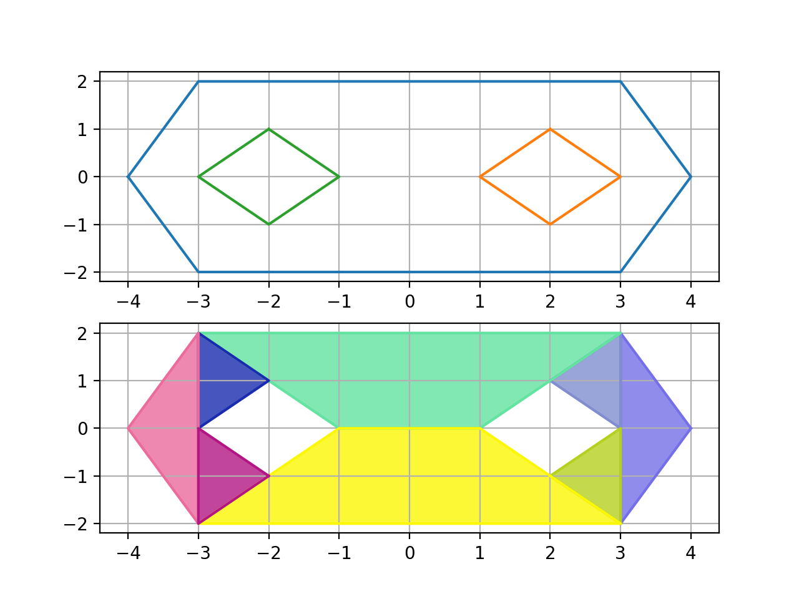

# decomp

[](https://ci.appveyor.com/project/ltjax/decomp)

This is a C++11 library to decompose simple 2D polygons with holes into a list of convex polygons.
It's primary application is navmesh-generation. All polygons are encoded as a list of indices
into a constant point list, so it's easy to extract connectivity information later.

Its goals are currently only robust functionality and hackability,
speed and memory consumption are of much lesser concern.

Here's a small example:

```C++
std::vector<Point> pointList={
  // points on the outer polygon
  {-4, 0}, {-3, -2}, {3, -2}, {4, 0}, {3, 2}, {-3, 2},
  // points on the left hole
  {-3, 0}, {-2, -1}, {-1, 0}, {-2, 1}, 
  // points on the right hole
  {1, 0}, {2, -1}, {3, 0}, {2, 1} 
};

std::vector<std::uint16_t> outerPolygon={
  0, 1, 2, 3, 4, 5
};

std::vector<std::vector<std::uint16_t>> holeList={
  {13, 12, 11, 10},
  {9, 8, 7, 6}
};

auto convexPolygonList=decompose(pointList, outerPolygon, holeList);
```

It produces the following decomposition:


